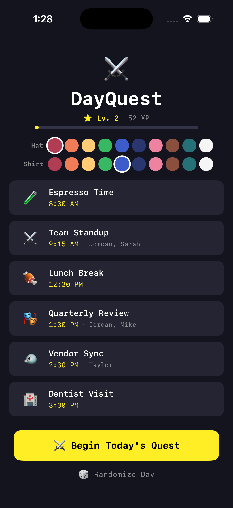
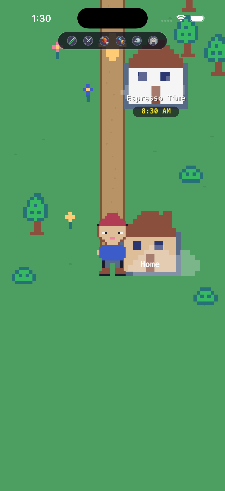
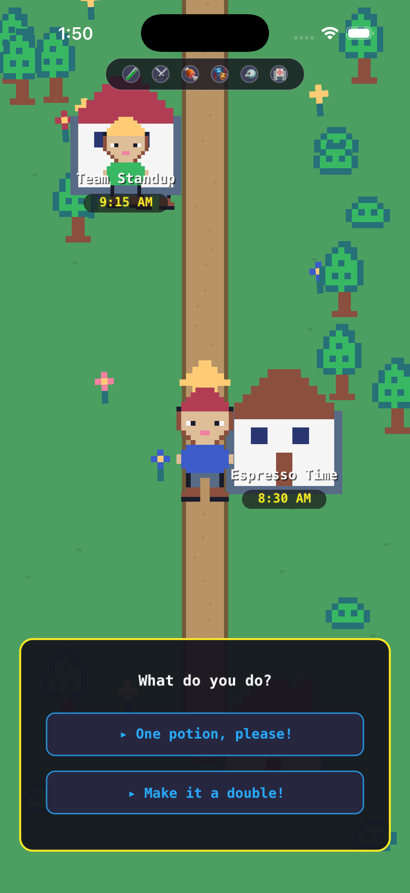
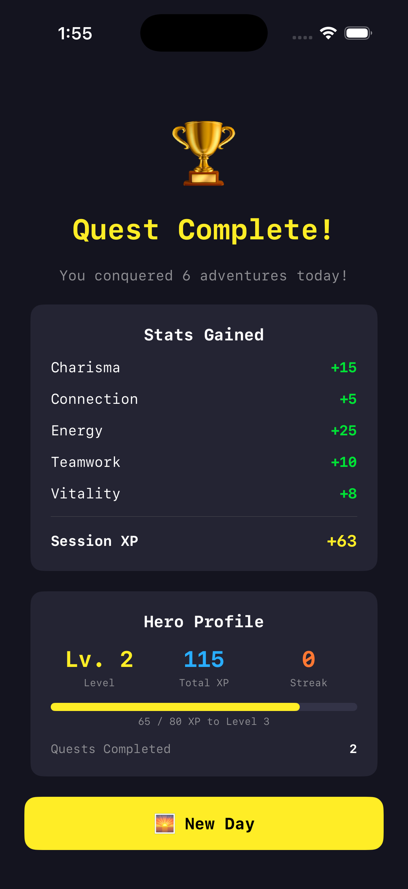

# DayQuest ⚔️

**Your daily calendar, reimagined as a charming pixel art RPG.**

DayQuest transforms the boring act of checking your calendar into a tiny adventure. Each morning (or night before), walk your pixel-art hero through the events of your day — meetings become council gatherings, phone calls become carrier pigeons, and coffee breaks become visits to the alchemist's shop.

## Screenshots

  
  
  
  

## The Idea

What if reviewing your calendar was actually fun? What if, instead of a list of abstract time blocks, you could *play through* your day as a mini-game?

**DayQuest gives you:**
- A cheerful, positive mindset before your day begins
- A mnemonic device that helps you remember what's happening and in what order
- Fun associations with even the boring parts of your day

Inspired by Stardew Valley's charm, The Sims' life simulation, Nathan Fielder's *The Rehearsal*, and Charlie Kaufman's *Synecdoche, New York*. Simulacrum as goal.

## How It Works

1. **See your day** — Events appear as a quest list with RPG-style icons
2. **Customize your hero** — Pick hat and shirt colors from the Sweetie 16 palette
3. **Walk through it** — Guide your character along a village path to each event
4. **Interact** — Choose fun responses at each stop ("Feast heartily!" / "Sample the specials!")
5. **Collect stats** — Earn Teamwork, Wisdom, Energy, Charisma, and more
6. **Level up** — XP, levels, and streaks persist across sessions
7. **Complete the quest** — See your Hero Profile with total stats

## Features

- **16x24 pixel art sprites** with chibi proportions, colored outlines, and warm Sweetie 16 palette
- **10 event types**: meeting, call, lunch, focus, exercise, coffee, errand, presentation, doctor, happy hour
- **Randomized dialogue** — 3 RPG-flavored variants per event type
- **Typewriter text reveal** on dialogue
- **Branching choices** with stat rewards and sparkle particle effects
- **Persistent progression** — XP, levels, streaks saved via UserDefaults
- **Character customization** — hat and shirt color picker
- **Living world** — floating clouds, fluttering butterflies, swaying flowers, dust trails
- **Intro camera pan** previewing your full day before gameplay
- **Walk-home celebration** with hearts and sparkles after completing all events
- **Progress HUD** with emoji dots tracking event completion
- **Hero Profile** on completion screen with level progress bar

## Tech Stack

- **Swift / SwiftUI** — App shell, overview & completion screens
- **SpriteKit** — Game engine, pixel art rendering, animations
- **No external dependencies** — All sprites procedurally generated from pixel arrays
- **Sweetie 16 palette** — Warm, charming 16-color palette
- **iOS 17+** — iPhone and iPad

## What's Next

- [ ] Real calendar integration (EventKit / Google Calendar)
- [ ] Sound effects and music
- [ ] More elaborate mini-interactions per event type
- [ ] Presentation rehearsal mode — upload slides/scripts and walk through them as game scenarios
- [ ] Memory palace mechanics — silly visual mnemonics tied to each event

## Building

Open `DayQuest.xcodeproj` in Xcode 15+ and run on an iOS 17+ device or simulator.

## License

MIT
